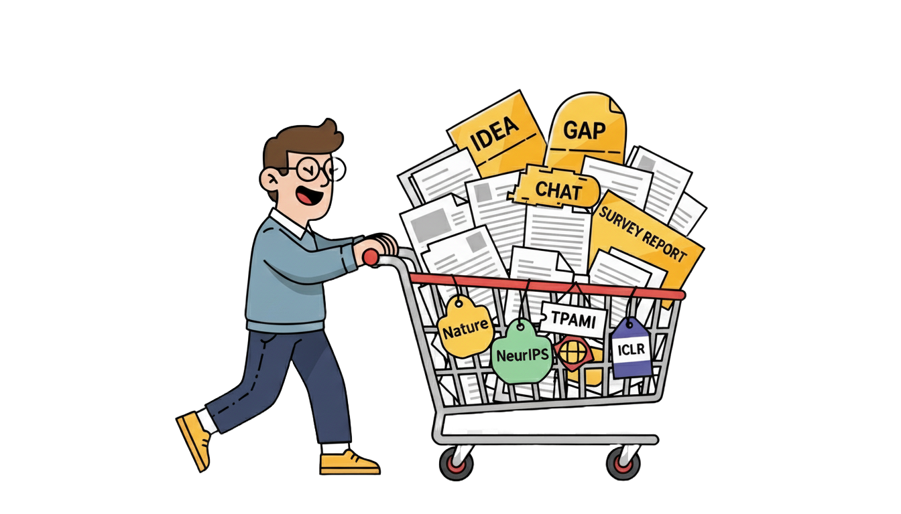
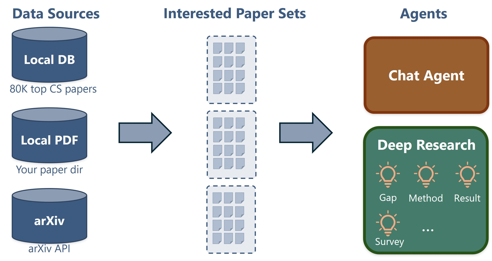
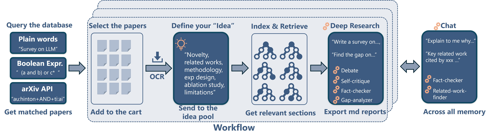
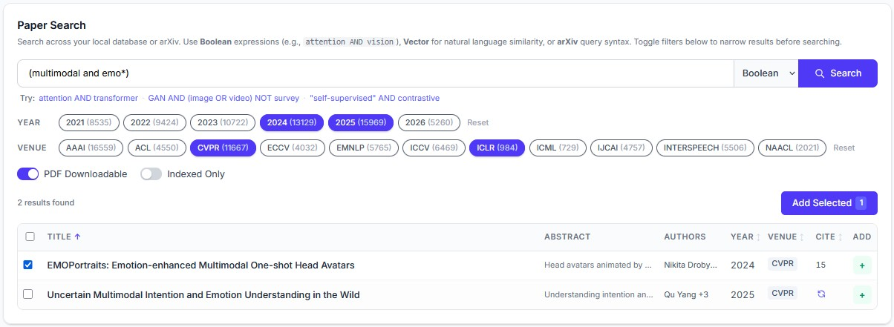
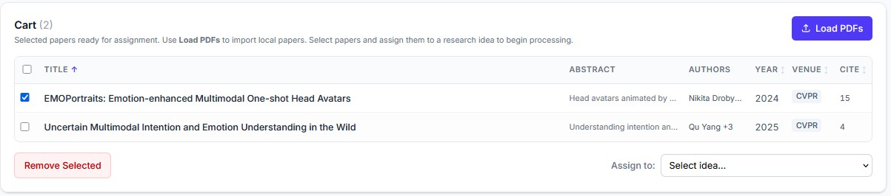
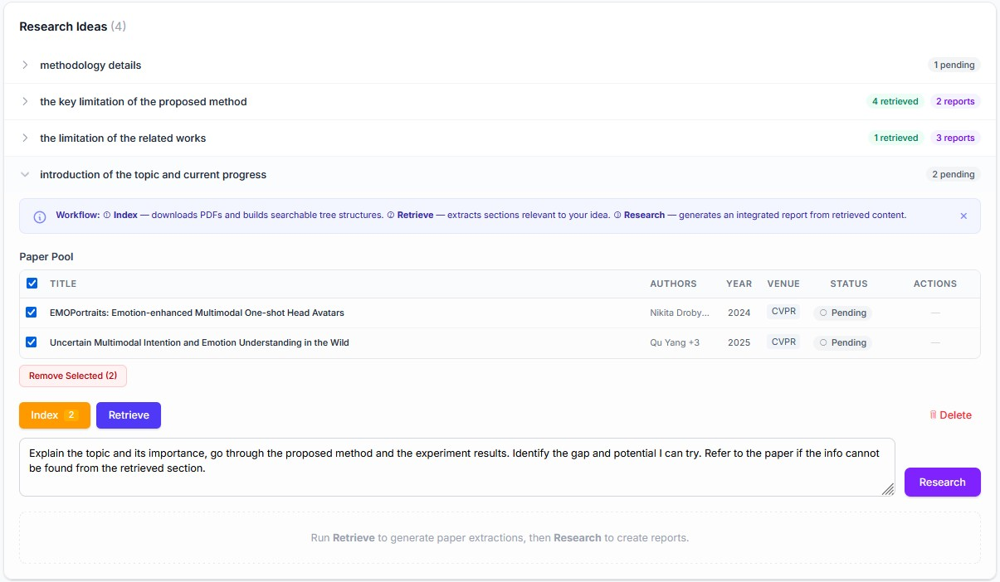
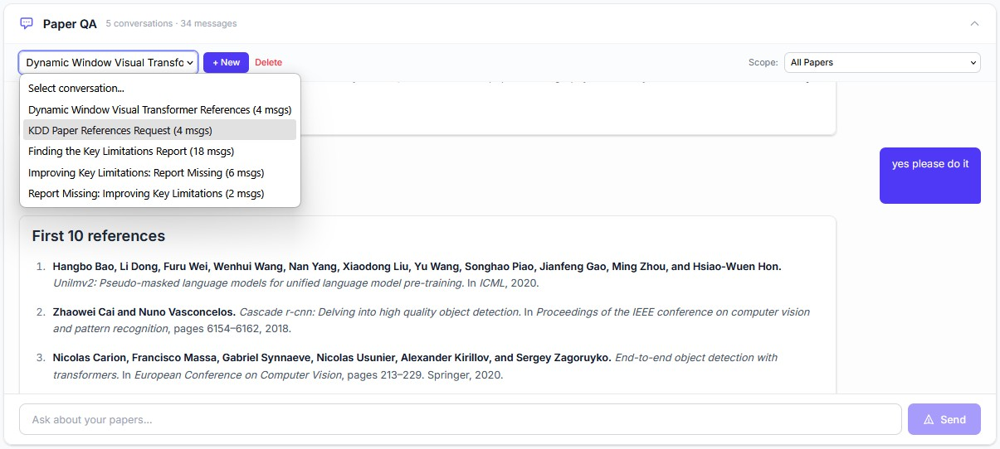

<a id="readme-top"></a>

<!-- PROJECT LOGO -->
<br />
<div align="center">
  
  <h3 align="center">Easy Paper</h3>
</div>


<!-- TABLE OF CONTENTS -->
<details>
  <summary>Table of Contents</summary>
  <ol>
    <li>
      <a href="#about-the-project">About The Project</a>
      <ul>
        <li><a href="#built-with">Built With</a></li>
      </ul>
    </li>
    <li>
      <a href="#getting-started">Getting Started</a>
      <ul>
        <li><a href="#prerequisites">Prerequisites</a></li>
        <li><a href="#installation">Installation</a></li>
      </ul>
    </li>
    <li><a href="#usage">Usage</a></li>
    <li><a href="#venues">Venues</a></li>
    <li><a href="#limitation">Limitation</a></li>
    <li><a href="#roadmap">Roadmap</a></li>
    <li><a href="#contributing">Contributing</a></li>
    <li><a href="#acknowledgments">Acknowledgments</a></li>
  </ol>
</details>


<!-- ABOUT THE PROJECT -->
## About The Project

<p align="center">
  
</p>

EasyPaper is a Human-in-the-Loop AI tool designed for large-scale literature review across fields or topics. It offers:
* A CS database with 80K top-tier papers from recent years and the whole [arXiv](https://arxiv.org/).
* Accurate RAG using vector-less tree-based indexing and AI.
* Deep Research and Chat agents built with [Langchain](https://docs.langchain.com/oss/python/langchain/overview) and [DeepAgents](https://docs.langchain.com/oss/python/deepagents/overview).


<!-- GETTING STARTED -->
### Built With

* [Langchain](https://docs.langchain.com/oss/python/langchain/overview) / [DeepAgents](https://docs.langchain.com/oss/python/deepagents/overview)
* [React](https://react.dev/) / [FastAPI](https://fastapi.tiangolo.com/)


<!-- GETTING STARTED -->
## Getting Started

The system works as a self-hosted React/FastAPI web application. 

### Prerequisites

Make sure you have the followings: 
* [node.js](https://nodejs.org/en/download/current) for Frontend
* Python 3.12+ for Backend
* [Marker API](https://www.datalab.to/app/keys) for PDF OCR
* One Text Embedding API key (Paid API or [Ollama](https://ollama.com/download)) for RAG
* One AI API key (Paid API or [Ollama](https://ollama.com/download)) for Chat and Deep Research

### Installation

_Below is an example of how you can instruct your audience on installing and setting up your app. This template doesn't rely on any external dependencies or services._

1. Clone the repo
   ```sh
   git clone https://github.com/github_username/EasyPaper.git
   ```
3. Install NPM packages
   ```sh
   # under EasyPaper/frontend/
   npm install
   ```
4. Install Python packages
   ```sh
   # under EasyPaper/backend/
   pip install -r requirements.txt
   ```
4. (Optional) Download the database (containing 80K top-tier CS papers) at Release, and put it into `EasyPaper/chroma_db/`
   ```sh
   # under EasyPaper/
   mkdir chroma_db
   # Then put the downloaded chroma.sqlite3 into EasyPaper/chroma_db
   ```
5. Provide your API keys and/or Ollama base url
   ```sh
   # under EasyPaper/
   cp .env.example .env
   # Then put your API keys or Ollama base url there
   ```
6. Edit the `EasyPaper/config.yaml` to specify your providers, models and configurations
7. Launch the app
   ```sh
   # under EasyPaper/
   python start.py
   # Then visit http://localhost:5173/
   ```


<div><p align="right">(<a href="#readme-top">back to top</a>)</p></div>


<!-- USAGE EXAMPLES -->
## Usage

<p align="center">
  
</p>

EasyPaper starts with creating a `Project`. You may also continue from an existing `Project`. A `Project` can have multiple `Idea`, each `Idea` can have multiple reports from different aspects. The `Research Agent` and `Chat Agent` can reach any reports or indexed papers under the same `Project`.


#### Query the database and Select the paper

EasyPaper supports three data sources:

+ A sqlite3 database containing 80K top-tier CS papers crawled from a [crawler](https://github.com/sucv/paperCrawler).
    + About 80% are downloadable (Top CS conferences).
    + The rest 20% contain only title, author, year, and publisher (Mostly top CS journals and a few conferences)
+ The arXiv API
    + Follow the [official example](https://info.arxiv.org/help/api/user-manual.html#detailed_examples) or ask AI
+ Your own PDFs
    + Could be the top journal papers you manually downloaded
    + If you are non-CS people and have some PDFs to analyze just like the [PaperQA](https://github.com/Future-House/paper-qa).


Choose your query method from `Vector`, `Boolean expression`, or `arXiv`, select the `Year` and `Venue`, then click Search. Select the interested paper in the results or check the citation count.

<p align="center">
  
</p>

If you are interested in adding more venues or years to the database, please refer to [paperCrawler](https://github.com/sucv/paperCrawler) and crawl by yourself. Then generate the Chroma vectorstore by running:

```sh
# under EasyPaper/
populate_chroma.py your_crawl.csv

```
<div><p align="right">(<a href="#readme-top">back to top</a>)</p></div>


#### Add to the cart

Add the selected paper to the `Cart` (also load your local PDFs to the cart), select or create an `Idea` and send the cart papers to your `Idea Panel`.


<p align="center">
  
</p>

<div><p align="right">(<a href="#readme-top">back to top</a>)</p></div>

#### Define your Idea

The `Idea` serve as the prompt, guiding the AI to find relevant information from the papers in an `Idea Panel`. The `Idea` can be named as one single word or sentences. It is your best interest to think about your `Idea`.

Content in the `Idea Panel` is preserved on your file system.

```sh
# Example 1 for getting the methodology details:
methodology details

# Example 2 for getting methodology and experiment  results
method and experiment

# Example 3 for getting the related works and reference
relevant works of the proposed method and the reference section
```

<div><p align="right">(<a href="#readme-top">back to top</a>)</p></div>

<!-- ROADMAP -->
#### Index and Retrieve

Click the `Index` , followed by the `Retrieve`. EasyPaper will download the paper, run the OCR, run the vector-less indexing, and retrieve the relevant nodes using AI.

 Once the relevant segments are retrieved, you can view or export them from the Column `Action`.


<p align="center">
  
</p>

<div><p align="right">(<a href="#readme-top">back to top</a>)</p></div>
#### Deep Research

Input your prompt in the text field, then click the `Research`. Once completed, you may view or export the report.

More than one `Research` can be conducted for an `Idea`.

#### Chat

In the `Paper QA` panel, you may create or continue a chat, and also choose the `Scope` of the conversation to one or all `Idea`(s).

The chat history is preserved on your file system.

<p align="center">
  
</p>

<div><p align="right">(<a href="#readme-top">back to top</a>)</p></div>

## Venues

|Type | Venue  | Year | 
|--------|-------------|--------|
|Conference| CVPR, ICCV, ECCV, ICLR, ICML, Neurips, AAAI, IJCAI, MM, KDD, WWW, ACL, EMNLP, NAACL, Interspeech, ICASSP        | Recent 5 years    |
|Journal| Nature, PNAS, Nat. Mach. Intell, TPAMI, IJCV, Proc. IEEE, ACM Comput. Surv., J. ACM, Info. Fusion., SIGGRAPH, TNNLS, etc...       | Recent 10 years    |

> All journals and some conferences (MM, KDD, WWW) papers are not downloadable (up to 20% of the whole database) These entries have only title, venue, year, and author, without abstract and pdf url. The user need to download manually should they match the query and interest.


<div><p align="right">(<a href="#readme-top">back to top</a>)</p></div>

## Limitation

EasyPaper degrades to a GUI-version [PaperQA](https://github.com/Future-House/paper-qa) for non-CS papers, as it can only rely on user provided papers in that case.

<!-- ROADMAP -->
## Roadmap

- [ ] Polish the Prompt
- [ ] Add more tools and skills
- [ ] Try to add non-CS papers to the database

<!-- CONTRIBUTING -->
## Contributing

If you have a suggestion that would make this better, please fork the repo and create a pull request. You can also simply open an issue with the tag "enhancement".
Don't forget to give the project a star! Thanks again!


<div><p align="right">(<a href="#readme-top">back to top</a>)</p></div>


<!-- ACKNOWLEDGMENTS -->
## Acknowledgments

* The RAG chunking and indexing are inspired by [PageIndex](https://github.com/VectifyAI/PageIndex).
* The surprisingly accurate OCR is powered by [Marker](https://github.com/datalab-to/marker).
* The 80K papers are crawled using [paperCrawler](https://github.com/sucv/paperCrawler).
* The tool is made using [Claude AI](https://claude.ai/).


<p align="right">(<a href="#readme-top">back to top</a>)</p>
